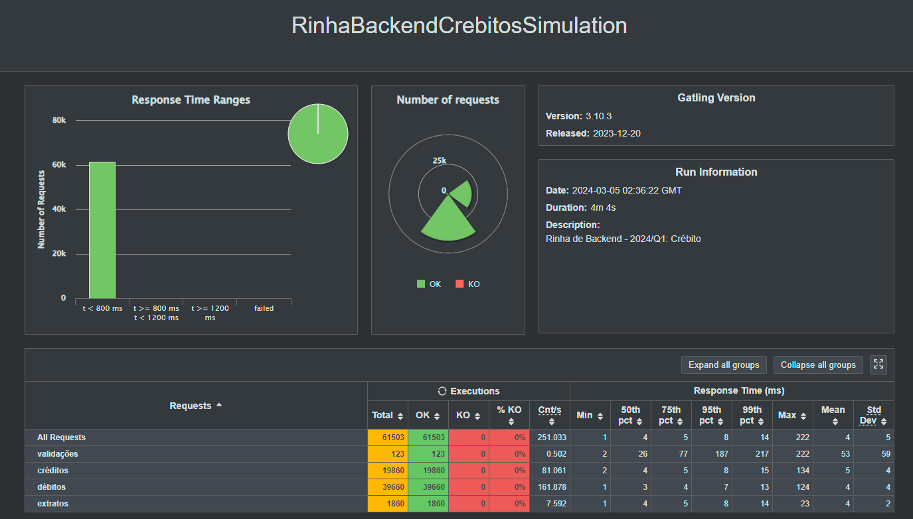
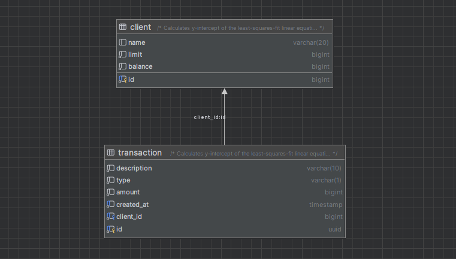

## Rinha de Backend 2024 Q1

### Tecnologias utilizadas
- [x] [Micronaut 4.3.4](https://micronaut.io/)
- [x] [Micronaut Data JDBC](https://micronaut-projects.github.io/micronaut-data/latest/guide/#pessimisticLocking)
- [x] [Micronaut Test Resources](https://micronaut-projects.github.io/micronaut-test-resources/latest/guide/)
- [x] [Micronaut Flyway](https://micronaut-projects.github.io/micronaut-flyway/latest/guide/)
- [x] [Micronaut Rest Assured](https://guides.micronaut.io/latest/micronaut-rest-assured-gradle-java.html)
- [x] [Postgres](https://www.postgresql.org/)
- [x] [GraalVM](https://www.graalvm.org/)
- [x] Java 21
- [x] Docker

### Resultado do teste do Gatling

### Database Model

